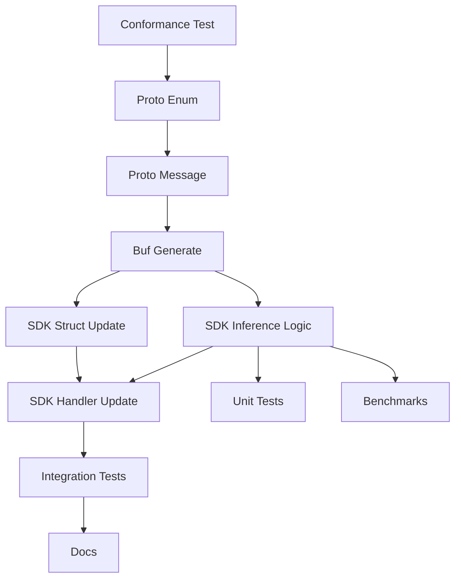

# Tasks: Add PluginCapability Enum

**Feature**: Add PluginCapability Enum for Feature Discovery
**Spec**: [specs/036-capability-enum/spec.md](spec.md)
**Branch**: `036-capability-enum`

## Phase 1: Setup

**Goal**: Initialize feature branch and documentation.

- [x] T001 Verify project structure and branch state in `specs/036-capability-enum`
- [x] T002 Update `GEMINI.md` with new feature context (already done via agent update)

## Phase 2: Foundational (Protobuf Contracts)

**Goal**: Define the Protocol Buffer contracts (The "Contract First" mandate).
**Blocking**: Must be completed before SDK implementation.

- [ ] T003 Define conformance tests for capability discovery in `sdk/go/pluginsdk/conformance_test.go` (Fails initially)
- [ ] T004 Define `PluginCapability` enum in `proto/finfocus/v1/enums.proto`
- [ ] T005 Add `capabilities` field to `GetPluginInfoResponse` in `proto/finfocus/v1/costsource.proto`
- [ ] T006 [P] Run `buf lint` to verify proto changes
- [ ] T007 Run `buf generate` to update Go SDK code in `sdk/go/proto/finfocus/v1`

## Phase 3: User Story 1 & 2 - SDK Auto-Discovery

**Goal**: Implement auto-discovery logic in Go SDK.
**Story**: [US1] Plugin Capability Discovery, [US2] SDK Auto-Discovery

- [ ] T008 [US2] Update `sdk/go/pluginsdk/plugin_info.go` to include `Capabilities` in `PluginInfo` struct
- [x] T009 [US2] Implement `inferCapabilities` helper function in
      `sdk/go/pluginsdk/plugin_info.go` using interface type assertions (zero-allocation goal)
- [x] T010 [US1] Update `GetPluginInfo` handler in `sdk/go/pluginsdk/sdk.go` to use inferred capabilities
- [x] T011 [P] [US1] Add unit tests for inference logic in `sdk/go/pluginsdk/plugin_info_test.go`
- [x] T012 [P] [US1] Benchmark `inferCapabilities` to ensure performance in `sdk/go/pluginsdk/plugin_info_benchmark_test.go`
- [x] T013 [US1] Verify `GetProjectedCost` auto-discovery explicitly via integration test

## Phase 4: User Story 3 - Backward Compatibility

**Goal**: Ensure legacy string-based capabilities still work.
**Story**: [US3] Backward Compatibility

- [x] T014 [P] [US3] Add integration test verifying both enum and string map in `sdk/go/pluginsdk/sdk_test.go`
- [x] T015 [US3] Verify `GetPluginInfo` handler populates legacy metadata map if missing

## Final Phase: Polish & Governance

**Goal**: Update documentation and project constitution.

- [x] T016 Update `PLUGIN_DEVELOPER_GUIDE.md` with new capability enum instructions
- [x] T017 Add "Capability Declaration" principle to `.specify/memory/constitution.md` (Section XII)
- [x] T018 Run full SDK validation suite (`make test` or `go test ./sdk/go/...`)
- [x] T019 Post implementation details to linked finfocus-core issue (mock task for CLI)

## Dependencies

## Implementation Strategy

1. **Test-First**: Write failing conformance tests (T003).
2. **Contracts**: Define the Proto enums (T004-T007).
3. **Logic**: Implement the Go SDK reflection logic (T008-T010).
4. **Performance**: Benchmark the inference logic (T012).
5. **Verify**: Ensure compatibility (T014-T015).
6. **Govern**: Update the Constitution (T017).
